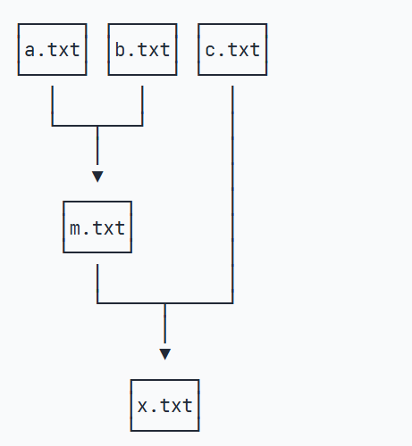

# Makefile

在Linux环境下，当键入make命令时，它就在当前目录查找一个名为Makefile的文件，然后根据这个文件定义的规则，自动化地执行任意命令，包括编译命令。

# 基础


Makefile由若干条规则构成，每一条规则指出一个目标文件，若干依赖文件，以及生成目标文件的命令。


例如要执行



规则如下

```python
# 目标文件: 依赖文件1 依赖文件2
m.txt: a.txt b.txt
	cat a.txt b.txt > m.txt
```

一条规则的格式是 `目标文件： 依赖文件1 依赖文件2...`，紧接着，以**Tab**开头的是命令，用来生成目标文件，以**#**开头的是注释。

make执行时，**自动执行第一条规则**，make会自动查询第一条指令所需的**依赖**，然后依次执行，因此其他规则的顺序是无关紧要的。


make命令会**自动检测文件是否已更新**，对于以更新的文件不会重复操作，这在大型项目中可以节省时间。


# 伪目标

删除时，可以编写一个clean规则

```makefile
clean:
	rm -f m.txt
	rm -f x.txt
```

要执行clean，必须用命令`make clean`

如果存在一个make文件，需要添加一个标识，让make不要把clean视为文件

```makefile
.PHONY: clean
clean:
	rm -f m.txt
	rm -f x.txt
```


大型项目通常会提供clean install等约定俗成的伪目标名称，一般来说也不需要用.PHONY标识clean等名称，除非有人故意破坏。


# 执行多条命令

一个规则可以有多条命令，例如

```makefile
cd:
	pwd
	cd ..
	pwd
```


上述的规则不会改变目录，因为每条命令在make中**默认独立shell执行的**，因此效果形如

```makefile
pwd           # 在一个子 shell 中执行，打印当前目录
cd ..         # 在另一个子 shell 中执行，目录变了，但退出就没用了
pwd           # 又是新的子 shell，目录没变
```


想要在同一个shell中执行，需要用**分号或者&&**，写在一行中

```makefile
cd:
	pwd;cd ..;pwd
```


用**\\**分行便于显示

```makefile
cd:
	pwd;\
	cd ..;\
	pwd
```

# 控制打印

默认情况下，make会打印之心的每一条命令，如果不想打印某一条命令，可以在命令前面加上**@**，表示不打印，但是仍然会执行。

```makefile 
no_output:
	@echo 'not display'
	echo 'will display'
```


# 控制错误

make执行时遇到错误会输出报错信息，然后**中断**执行，有的时候想要**继续执行**下去，就需要用到**-**

```makefile
rm:
        -rm  noExist.txt
        echo "fine, it  doesn;t exist"
```


# 编译C程序


以上述为例

```makefile
world.out:hello.o main.o
        cc -o world.out hello.o main.o
hello.o:hello.c
        cc -c hello.c
main.o:main.c hello.h
        cc -c main.c # 不指定-o的话默认将 源文件名.c 替换成 .o 输出，也可以执行cc -c main.c -o mymain.o，或者cc -c -o xyz.o xyz.c
clean:
        rm -f *.o world.out
```

首行放置最终要得到的可以执行文件，然后处理源文件，cc是gcc的简写


make内置了一条隐式规则——**如果没有找到.o文件，自动执行**

```makefile
xyz.o: xyz.c
	cc -c -o xyz.o xyz.c
```

因此规则可以简化为

```makefile
world.out:hello.o main.o
        cc -o world.out hello.o main.o
clean:
        rm -f *.o world.out
```

但是隐式规则有一个潜在的问题，那就是无法跟踪`.h`文件的修改


# 使用变量

make中可使用变量代替重复出现的文件名

变量的定义使用 `变量名=值` 或者`变量名:=值`，通常变量名大写，引用变量使用`$(变量名)`

```makefile 
TARGET = world.out
ORG = hello.o main.o
$(TARGET): $(ORG)
        cc -o $(TARGET) $(ORG)
clean:
        rm -f *.o $(TARGET)
```

相当于定义了一个**宏**，其实命令cc也可以定义为`CC = riscv64-linux-gnu-gcc`


此外还有一些自动变量

| 自动变量 | 含义简述                        | 示例值           |
| -------- | ------------------------------- | ---------------- |
| `$@`     | 当前规则的 **目标文件名**       | `main.o`         |
| `$<`     | 当前规则的 **第一个依赖文件**   | `main.c`         |
| `$^`     | 当前规则的 **所有依赖（去重）** | `main.c hello.h` |

```makefile 
world.out: hello.o main.o
	@echo '$$@ = $@' # 变量 $@ 表示target
	@echo '$$< = $<' # 变量 $< 表示第一个依赖项
	@echo '$$^ = $^' # 变量 $^ 表示所有依赖项
	cc -o $@ $^
```

```makefile 
$@ = world.out
$< = hello.o
$^ = hello.o main.o
cc -o world.out hello.o main.o
```


# 使用模式规则

当需要构建目标文件时，又没有显示规则时，make会尝试**匹配模式规则**来自动构建它

```makefile 
%.o: %.c
	@echo 'compiling $<...'
	cc -c -o $@ $<
```


```makefile 
TARGET = world.out
ORG = hello.o main.o
$(TARGET): $(ORG)
        @echo '$$@ = $@'
        @echo '$$< = $<'
        @echo '$$^ = $^'
        cc -o $@ $^
%.o: %.c
        @echo 'compiling $<...'
        cc -c -o $@ $<
clean:
        rm -f *.o world.out
```


# 内建函数

```makefile
$(wildcard pattern)
$(wildcard *.c) # 找出所有的c文件
```

列出当前目录下匹配某个模式的所有文件名


```makefile 
$(patsubst 模式, 替换, 字符串列表)
$(patsubst %.c, %.o,$(wildcard *.c)) # 将目录下的.c文件转换为.o(文件名)
```

模式替换

# 自动生成依赖

在之前提到过，隐式规则无法追踪头文件的修改

```makefile
# 列出所有 .c 文件:
SRCS = $(wildcard *.c)

# 根据SRCS生成 .o 文件列表:
OBJS = $(SRCS:.c=.o)

# 根据SRCS生成 .d 文件列表:
DEPS = $(SRCS:.c=.d)

TARGET = world.out

# 默认目标:
$(TARGET): $(OBJS)
	$(CC) -o $@ $^

# xyz.d 的规则由 xyz.c 生成:
%.d: %.c
	rm -f $@; \
	$(CC) -MM $< >$@.tmp; \
	sed 's,\($*\)\.o[ :]*,\1.o $@ : ,g' < $@.tmp > $@; \
	rm -f $@.tmp

# 模式规则:
%.o: %.c
	$(CC) -c -o $@ $<

clean:
	rm -rf *.o *.d $(TARGET)

# 引入所有 .d 文件:
-include $(DEPS)

```

